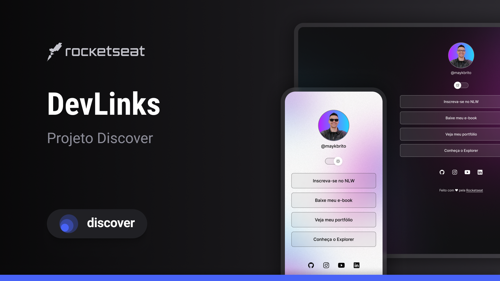

# DevLinks 🔗

> <h3>Description 💬</h3>

- DevLinks it's a simple project to group important links you might have, and your main social media.
- You can use it anywhere, for example, at your Instagram's biography.

  

> <h3>Tutorial 📢</h3>

- To use it it's pretty simple! You just have to follow the lines below.

  - Download the zipped code in your desktop
  - Unzip the folder
  - Open the folder in your favorite editor and change to your informations.

- It's done!

> <h3>Tecnologies ↗️</h3>

- It was entirely made with HTML, CSS and JavaScript.
- The editor chosen was VSCode.
- You can access the design on Figma <a href="https://www.figma.com/community/file/1187422022288947321">here</a>, made by Rocketseat team.

 

Thank you for reading ❣️
